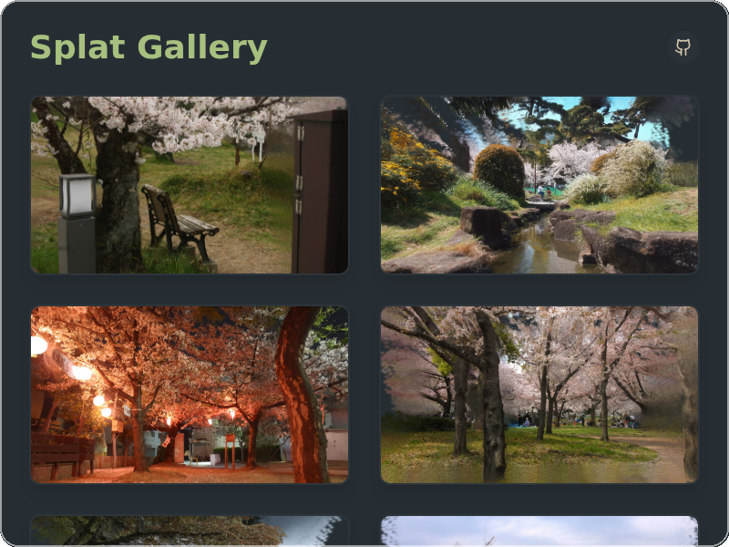
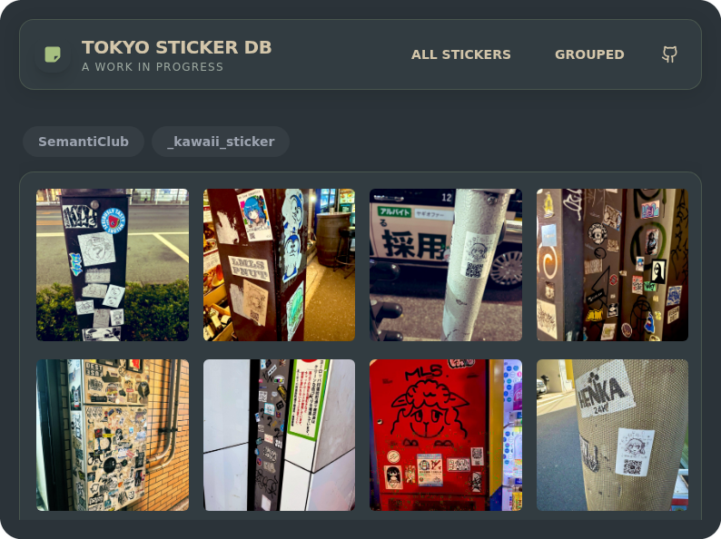
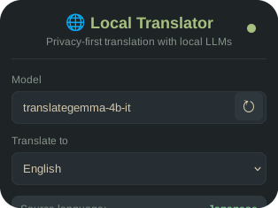
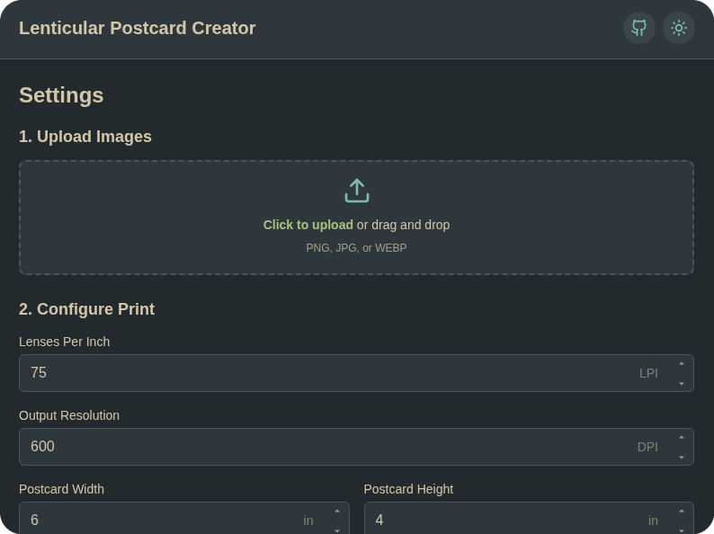
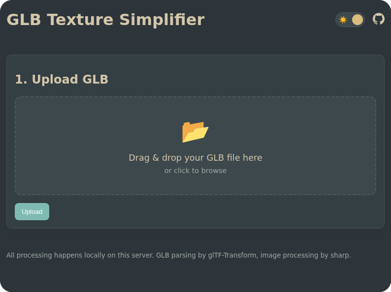
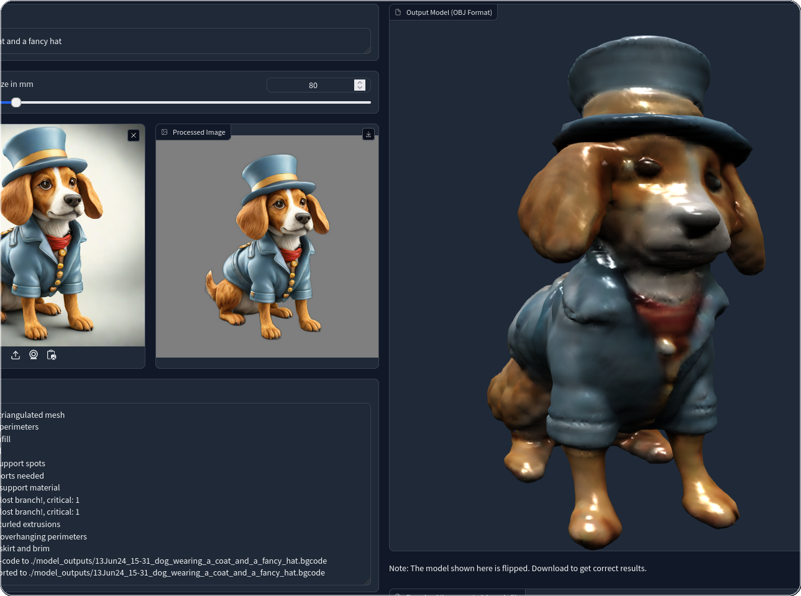
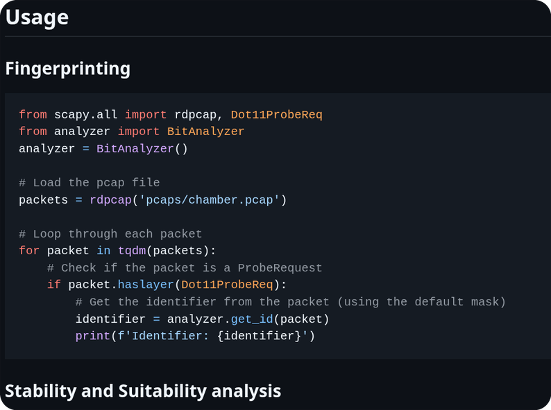
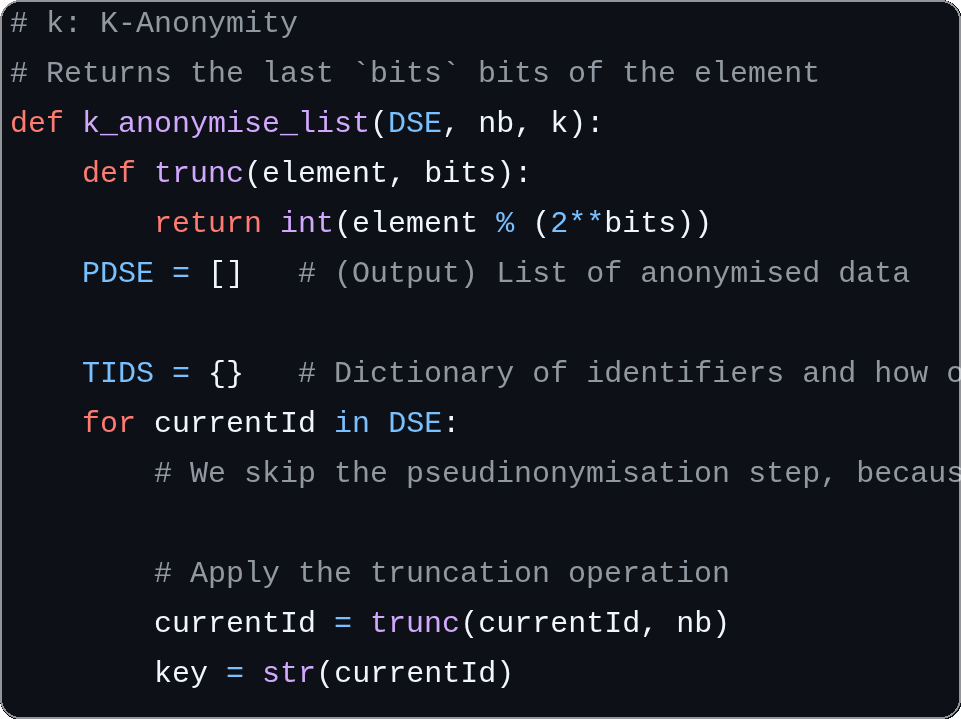

# Eldoprano

### Project Portfolio

<table width="100%">
  <tr>
    <td width="33%" valign="top">
      
       
      <a href="https://github.com/Eldoprano/photo-splat-gallery"><b>Photo Splat Gallery</b></a>
       
      3D Gaussian Splat gallery with AR and tilt interaction.
    </td>
    <td width="33%" valign="top">
      
       
      <a href="https://github.com/Eldoprano/tokyo-sticker-db"><b>Tokyo Sticker DB</b></a>
       
      Segmentation, grouping and visualization of Tokyo stickers.
    </td>
    <td width="33%" valign="top">
      
       
      <a href="https://github.com/Eldoprano/learn-kana"><b>Learn Kana</b></a>
       
      For practicing Japanese hiragana and katakana characters.
    </td>
  </tr>
  <tr>
    <td width="33%" valign="top">
      
       
      <a href="https://github.com/Eldoprano/offline-browser-translate"><b>Local Translator</b></a>
       
      Privacy-first extension for web translation via local LLMs.
    </td>
    <td width="33%" valign="top">
      
       
      <a href="https://github.com/Eldoprano/Lenticular-Postcard-Generator"><b>Lenticular Generator</b></a>
       
      Creator and visualization for lenticular postcards.
    </td>
    <td width="33%" valign="top">
      
       
      <a href="https://github.com/Eldoprano/test-drive-peru-A1"><b>Peru Driving Test</b></a>
       
      Page to practice the questions to get a Peruvian drivers licence.
    </td>
  </tr>
  <tr>
    <td width="33%" valign="top">
      
       
      <a href="https://github.com/Eldoprano/3d-texture-compressor"><b>3D Texture Compressor</b></a>
       
      Online tool to compress GLB textures for 3D objects.
    </td>
    <td width="33%" valign="top">
      
       
      <a href="https://github.com/Eldoprano/Project-3D-Gen-4-Print"><b>3D Gen for Print</b></a>
       
      Generative printable 3D objects based on multimodal input.
    </td>
    <td width="33%" valign="top">
      
       
      <a href="https://github.com/Eldoprano/probe_request_fingerprinting"><b>WiFi Fingerprinting</b></a>
       
      PCAP-based ID of mobile devices using probe requests.
    </td>
  </tr>
  <!-- <tr>
    <td width="33%" valign="top">
      
       
      <a href="https://gist.github.com/Eldoprano/0c09fd33b9dfd3e6b8d396159b4a9bfd"><b>Data Structures Gist</b></a>
       
      Comparison of probabilistic data structures for LoRaWAN.
    </td>
    <td width="33%" valign="top">
    </td>
    <td width="33%" valign="top">
    </td>
  </tr> -->
</table>
